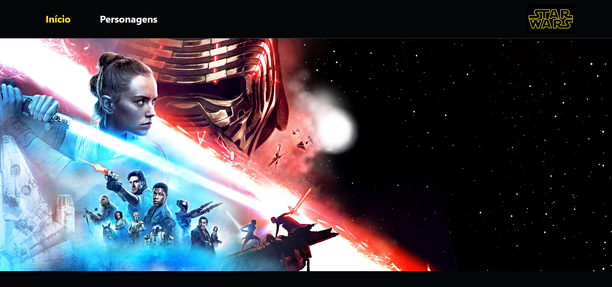

# Desafio Frontend Star Wars INFLOR



## Instalar Dependências
```sh
# clonar ou baixar projeto
git clone https://github.com/jully-nixon/star-wars.git

# após clonar, ir para o diretório do projeto
cd star-wars/

# digitar o comando abaixo para instalar as dependências do projeto
npm install
```

### Executar Projeto
```sh
# após instalar as dependências, digitar o comando abaixo para compilar e executar o projeto
npm start
# acessar http://localhost:3000/
```

## Tecnologias Utilizadas

- [ReactJS](https://pt-br.reactjs.org/)
- HTML
- CSS
- Javascript
- API [SWAPI](https://swapi.dev/)

## Link para acesso em nuvem

[Vercel](https://star-wars-jully-nixon.vercel.app)
